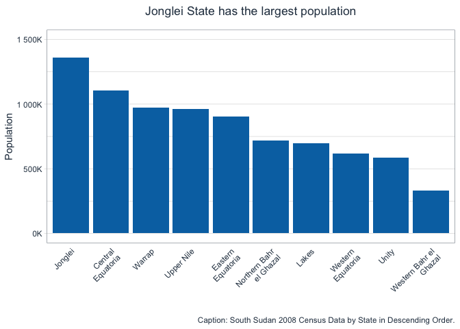

Marrying R with Python - 1
================
Alier Reng
2021-07-18

## Table of Contents

-   Loading `R` Packages: `tidyverse` and `reticulate`
-   Importing `Python` Libraries: `numpy` and `pandas`,
-   Importing, cleaning, transforming, and manipulating data
-   Visualization data with `ggplot2`
-   Conclusion
-   References

## Introduction

Most data scientists and data analysts would agree with the assertion
that *data scientists and data analysts spend 80% of their time cleaning
and transforming data - or simply put, performing data wrangling.*
Because it’s imperative to transform your data into a tidy form before
using it in your data science project. This means that aspiring data
scientists and data analysts must learn data manipulation techniques and
know the data munging tools in their programming languages to succeed in
their data science careers. This article will demonstrate how to perform
data wrangling with the `pandas` library - I personally love `pandas`
although I am an `R` programmer.

`Pandas` was written by *Wes McKinney* as ***"the open source Python
library for data analysis**." (Python for Data Analysis, 2017, pp.111)*

> `pandas` is built on top of `NumPy` and makes it easy to use in
> `NumPy-centric` applications.*(Python for Data Analysis, 2017,
> pp.111)*

This is the first article in our **Data Wrangling With pandas** series.
So keep an eye on our next article - we plan to be releasing at least
one piece quarterly for the rest of 2021.

Our prime objective is to demonstrate how to clean, transform and
manipulate data with the `pandas` library within the `RStudio`. We’ll
“kill two birds with a single stone!” That’s, we’ll first wrangle our
data and tabulate it with `pandas`. Next, we’ll visualize our data with
`ggplot2` - the most popular `R` data visualization package.

#### Loading `R` Packages

Here we’ll load both `tidyverse` and `reticulate` packages. The
`reticulate` package allows us to use `Python` within the `RStudio`. Of
course, we’ll use `dplyr` and `ggplot2` from `tidyverse` (we could have
loaded these packages individually, but we decided to load them this
way).

``` r
# Load R packages.
library(reticulate)
library(tidyverse)

# set colorblind-friendly color palette.
colorblind_palette <- c("black", "#E69F00", "#56B4E9", "#009E73",
                        "#CC79A7", "#F0E442", "#0072B2", "#D55E00")
```

#### Loading the `pandas` Library and Setting the Printing Options

In this section, we’ll load `pandas` and `numpy`, and set up printing
options to display all columns, as well as disable the future warnings.

``` python
# Importing libraries that we'll use in this project.
import pandas as pd
import numpy as np

# Setting printing options; showing all the columns.
pd.set_option('max_columns', 999)

# Disabling Future Warnings.
import warnings
warnings.filterwarnings('ignore', category=FutureWarning)
```

## Transforming the Data

Data transformation is the most crucial step when doing a data science
project (because the success of your project depends on having clean,
tidy data). Therefore, it’s worthwhile taking your time to ensure that
your data is thoroughly cleaned and transformed appropriately. This is
the topic or objective of this article - performing data wrangling with
the `pandas` library.

#### Importing the Dataset

We’ll use the South Sudan 2008 Census dataset in this project. So, we’ll
load it as shown below.

``` python
# Import the dataset.
ss_2008_census_df = pd.read_csv('/Users/areng/Desktop/blog_articles/00_Data/ss_2008_census_data_raw.csv')

# Inspect the first 5 Rows.
ss_2008_census_df.head()
```

    ##   Region Region Name Region - RegionId Variable               Variable Name  \
    ## 0  KN.A2  Upper Nile             SS-NU    KN.B2  Population, Total (Number)   
    ## 1  KN.A2  Upper Nile             SS-NU    KN.B2  Population, Total (Number)   
    ## 2  KN.A2  Upper Nile             SS-NU    KN.B2  Population, Total (Number)   
    ## 3  KN.A2  Upper Nile             SS-NU    KN.B2  Population, Total (Number)   
    ## 4  KN.A2  Upper Nile             SS-NU    KN.B2  Population, Total (Number)   
    ## 
    ##      Age  Age Name  Scale    Units      2008  
    ## 0  KN.C1     Total  units  Persons  964353.0  
    ## 1  KN.C2    0 to 4  units  Persons  150872.0  
    ## 2  KN.C3    5 to 9  units  Persons  151467.0  
    ## 3  KN.C4  10 to 14  units  Persons  126140.0  
    ## 4  KN.C5  15 to 19  units  Persons  103804.0

``` python
# Inspect the last 5 rows.
ss_2008_census_df.tail()
```

    ##             Region                                        Region Name  \
    ## 448         KN.A11                                  Eastern Equatoria   
    ## 449         KN.A11                                  Eastern Equatoria   
    ## 450            NaN                                                NaN   
    ## 451        Source:         National Bureau of Statistics, South Sudan   
    ## 452  Download URL:  http://southsudan.opendataforafrica.org/fvjqdp...   
    ## 
    ##     Region - RegionId Variable                Variable Name     Age  Age Name  \
    ## 448             SS-EE    KN.B8  Population, Female (Number)  KN.C14  60 to 64   
    ## 449             SS-EE    KN.B8  Population, Female (Number)  KN.C22       65+   
    ## 450               NaN      NaN                          NaN     NaN       NaN   
    ## 451               NaN      NaN                          NaN     NaN       NaN   
    ## 452               NaN      NaN                          NaN     NaN       NaN   
    ## 
    ##      Scale    Units    2008  
    ## 448  units  Persons  5274.0  
    ## 449  units  Persons  8637.0  
    ## 450    NaN      NaN     NaN  
    ## 451    NaN      NaN     NaN  
    ## 452    NaN      NaN     NaN

#### Deleting Rows with Missing Values

As you can see in the above outputs, our data contains several columns
that we do not need or do not make sense for our purpose. Next, let’s
also inspect the last five rows and determine if our data has any
missing values or not.

``` python
# Display the rows and columns of our dataset.
ss_2008_census_df.shape
```

    ## (453, 10)

``` python
# Check for NAs.
ss_2008_census_df.isnull().sum()
```

    ## Region               1
    ## Region Name          1
    ## Region - RegionId    3
    ## Variable             3
    ## Variable Name        3
    ## Age                  3
    ## Age Name             3
    ## Scale                3
    ## Units                3
    ## 2008                 3
    ## dtype: int64

The above outputs of the last five rows indicate that our data contains
multiple rows with missing values (or nas), the data source, and the
download URL where we obtained our dataset. We’ll delete these rows that
do not contribute any value to our analysis. Also, we see above that our
data consists of 10 columns (or variables/features) and 453 rows (or
observations). To obtain or display our data dimensions in `Python`, we
use the `shape`, a data attribute. `Python's` data attributes are
different from functions in that we omit the parentheses `"()"` after
the attribute. Further, above we displayed the counts of missing values
in each column of our dataset with `isnull` (which is similar to
`isna()`) to extract the rows with `nas` and then tallied them with
`sum()` to find the sum of the rows with the missing values in each
column. These methods come in handy when we want to obtain a quick
summary of the rows and columns with missing values in our dataset.

``` python
# Delete NAs.
ss_2008_census_df = ss_2008_census_df.dropna(how = 'any', axis = 0)

# Convert column names to the list and print the list.
ss_2008_census_df.columns.to_list()
```

    ## ['Region', 'Region Name', 'Region - RegionId', 'Variable', 'Variable Name', 'Age', 'Age Name', 'Scale', 'Units', '2008']

In the preceding code chunk, we first deleted the rows with missing
values with `dropna()` by setting how to “any” and axis to “0” (or
rows). Next, we output the column names with `column.to_list()` to
subset our data with the columns of interest. Here, we’re only
interested in these columns: ‘Region Name’, ‘Variable Name’, ‘Age Name’,
and ‘2008’. And in the below code chunk, we selected these columns using
double square brackets (`[[]]`). Next, we converted the population
column “2008” to integer or numeric values using the `astype()` method
and supplied it with the data type `int`, short for `integer`. Lastly,
we inspected the first five rows with the `head()`.

``` python
# Subset the data by selecting only the columns to focus on.
ss_2008_census_df = ss_2008_census_df[['Region Name', 'Variable Name', 'Age Name', '2008']]

# Convert the population column to integer values.
ss_2008_census_df['2008'] = ss_2008_census_df['2008'].astype('int')

# Inspect the first five rows.
ss_2008_census_df.head()
```

    ##   Region Name               Variable Name  Age Name    2008
    ## 0  Upper Nile  Population, Total (Number)     Total  964353
    ## 1  Upper Nile  Population, Total (Number)    0 to 4  150872
    ## 2  Upper Nile  Population, Total (Number)    5 to 9  151467
    ## 3  Upper Nile  Population, Total (Number)  10 to 14  126140
    ## 4  Upper Nile  Population, Total (Number)  15 to 19  103804

``` python
# Perform feature engineering: split the variable name column by space.
ss_2008_census_df['Gender'] = ss_2008_census_df['Variable Name'].str.split(' ', ).str[1]

# Inspect the first five rows.
ss_2008_census_df.head()
```

    ##   Region Name               Variable Name  Age Name    2008 Gender
    ## 0  Upper Nile  Population, Total (Number)     Total  964353  Total
    ## 1  Upper Nile  Population, Total (Number)    0 to 4  150872  Total
    ## 2  Upper Nile  Population, Total (Number)    5 to 9  151467  Total
    ## 3  Upper Nile  Population, Total (Number)  10 to 14  126140  Total
    ## 4  Upper Nile  Population, Total (Number)  15 to 19  103804  Total

#### Using the split()

As you can see above, the “Variable Name” column contains three pieces
of information: ***“Population”***, ***“Total/Male/Female”*** and
***“(Number)”***, separated by both comma and spaces. This column
contains gender information, so we’re only interested in the
***“Total/Male/Female”*** portion of this column. Therefore, we split
this column into three columns using the `split()` method (combined with
`str` since this is a string), but we only kept the middle portion using
its index.

#### Selecting And Renaming the Columns To Focus on

``` python
# Select desired columns.
ss_2008_census_df_1 = ss_2008_census_df[['Region Name', 'Gender', 'Age Name', '2008']]

# Filter the data to exclude rows with the 'Total.'
ss_2008_census_df_1 = ss_2008_census_df_1[(ss_2008_census_df_1['Gender'] != 'Total') & (ss_2008_census_df_1['Age Name'] != 'Total')]

# Rename the columns: 'Region Name', 'Age Name' and '2008'.
ss_2008_census_df_1 = ss_2008_census_df_1.rename(columns = {'Region Name': 'State', 'Age Name':'Age Category', '2008':'Population'})
```

In the above chunk, we re-selected the columns we need for our project
using the double square brackets, `[[]]`. Next, we removed the rows with
the **Total** population because we’ll recalculate these values by
ourselves. Last, we renamed our columns of interest using the `rename()`
method.

#### Modifying Column Values with the replace() Method

``` python
# Modify state names with replace().
new_age_cats = {'Age Category':{'0 to 4':'0 -9', '5 to 9':'0 -9', '10 to 14':'10 - 19', '15 to 19':'10 - 19', '20 to 24':'20 - 29', '25 to 29':'20 - 29', '30 to 34':'30 - 39', '35 to 39':'30 - 39', '40 to 44':'40 - 49', '45 to 49':'40 - 49', '50 to 54':'50 - 59', '55 to 59':'50 - 59', '60 to 64':'60 +', '65+':'60 +'}}

ss_2008_census_df_1.replace(new_age_cats, inplace = True)

# View the first 5 rows.
ss_2008_census_df_1.head()
```

    ##          State Gender Age Category  Population
    ## 16  Upper Nile   Male         0 -9       82690
    ## 17  Upper Nile   Male         0 -9       83744
    ## 18  Upper Nile   Male      10 - 19       71027
    ## 19  Upper Nile   Male      10 - 19       57387
    ## 20  Upper Nile   Male      20 - 29       42521

Now that we have the columns we need for our task, let’s create new bins
or categories for the **Age Category** column since there’re too many
categories, which would overstretch over data. We do this with the
`replace()` method from the [pandas
library](https://pandas.pydata.org/docs/reference/api/pandas.DataFrame.replace.html).
The `replace` method works as follows:

-   df.replace(‘old value’, ’new value), for a single value. Or

-   df.replace(\[‘old value 1’, ‘old value 2’, ‘old value 3’\], \[‘new
    value 1’, ‘new value 2’, ‘new value 3’\]) for a list of values. Or

-   df.replace({‘colum\_name’: {‘old value 1’:‘new value 1’, ‘old value
    2’:‘new value 2’}})

The last method is what we used in the above chunk to create new age
categories for our dataset.

#### Computing Aggregates with `groupby()` and `agg()` Methods

``` python
# Group the dataset by state, gender, and age category, and then summarize.
ss_2008_census_df_2 = ss_2008_census_df_1.groupby(['State', 'Gender', 'Age Category']).agg(Population = ('Population', 'sum')).reset_index()

# View the first 5 rows.
ss_2008_census_df_2.head()
```

    ##                State  Gender Age Category  Population
    ## 0  Central Equatoria  Female         0 -9      155756
    ## 1  Central Equatoria  Female      10 - 19      127336
    ## 2  Central Equatoria  Female      20 - 29      105011
    ## 3  Central Equatoria  Female      30 - 39       65871
    ## 4  Central Equatoria  Female      40 - 49       35805

``` python
# Group the dataset by state and then summarize.
ss_2008_census_state_totals_df = ss_2008_census_df_2.groupby('State').agg(Population = ('Population', 'sum')).reset_index(level = 'State')

# Rearrange the dataset by population size in descending order.
ss_2008_census_state_totals_df.sort_values(['Population'], ascending = False, inplace = True)

# Reset the index.
ss_2008_census_state_totals_df.reset_index(drop=True)
```

    ##                      State  Population
    ## 0                  Jonglei     1358602
    ## 1        Central Equatoria     1103557
    ## 2                   Warrap      972928
    ## 3               Upper Nile      964353
    ## 4        Eastern Equatoria      906161
    ## 5  Northern Bahr el Ghazal      720898
    ## 6                    Lakes      695730
    ## 7        Western Equatoria      619029
    ## 8                    Unity      585801
    ## 9   Western Bahr el Ghazal      333431

``` python
# Group the dataset by state and gender; summarize.
ss_2008_census_state_by_gender_df = ss_2008_census_df_2.groupby(['State', 'Gender']).agg(Population = ('Population', 'sum')).reset_index(level = 'Gender')

# Rearrange the dataset by population size and state in descending order.
ss_2008_census_state_by_gender_df.sort_values(['Population', 'State'], ascending = False, inplace = True)

# Print the dataset.
ss_2008_census_state_by_gender_df
```

    ##                          Gender  Population
    ## State                                      
    ## Jonglei                    Male      734327
    ## Jonglei                  Female      624275
    ## Central Equatoria          Male      581722
    ## Upper Nile                 Male      525430
    ## Central Equatoria        Female      521835
    ## Warrap                   Female      502194
    ## Warrap                     Male      470734
    ## Eastern Equatoria          Male      465187
    ## Eastern Equatoria        Female      440974
    ## Upper Nile               Female      438923
    ## Northern Bahr el Ghazal  Female      372608
    ## Lakes                      Male      365880
    ## Northern Bahr el Ghazal    Male      348290
    ## Lakes                    Female      329850
    ## Western Equatoria          Male      318443
    ## Western Equatoria        Female      300586
    ## Unity                      Male      300247
    ## Unity                    Female      285554
    ## Western Bahr el Ghazal     Male      177040
    ## Western Bahr el Ghazal   Female      156391

Now that we have cleaned, manipulated, and transformed our dataset, we
will shift our attention to exploratory data analysis (or **EDA**). So,
in the above chunk, we grouped the dataset with the `groupby()` method
using the *State* column and then computed states’ total populations
with the `agg()` method. Next, we reset the index with the
`reset_index()` method. Additionally, we set ascending to False to not
arrange our dataset in the ascending order and inplace to True\`, to
overwrite the settings. Further, we sorted the dataset based on the
population size and the State column. Last, we displayed the dataset.

#### Tabulating the Dataset with the `pandas pivot_table()`

``` python
# Pivot the dataset.
table = pd.pivot_table(ss_2008_census_df_2, values = 'Population', index = ['State', 'Gender'],
                     aggfunc = np.sum, margins = True, margins_name = 'Total Population')
 
# Rearrange the dataset by population size and state in descending order.                    
table.sort_values(['Population', 'State'], ascending = False, inplace = True)

# Print the table.
table
```

    ##                                 Population
    ## State                   Gender            
    ## Total Population                   8260490
    ## Jonglei                 Male        734327
    ##                         Female      624275
    ## Central Equatoria       Male        581722
    ## Upper Nile              Male        525430
    ## Central Equatoria       Female      521835
    ## Warrap                  Female      502194
    ##                         Male        470734
    ## Eastern Equatoria       Male        465187
    ##                         Female      440974
    ## Upper Nile              Female      438923
    ## Northern Bahr el Ghazal Female      372608
    ## Lakes                   Male        365880
    ## Northern Bahr el Ghazal Male        348290
    ## Lakes                   Female      329850
    ## Western Equatoria       Male        318443
    ##                         Female      300586
    ## Unity                   Male        300247
    ##                         Female      285554
    ## Western Bahr el Ghazal  Male        177040
    ##                         Female      156391

Here we tabulated our dataset with the `pivot_table()` method. Next, we
sorted the table by Population and State columns, and then we displayed
the table.

## Marrying `R` with `Python`

Our objective in this article is to demonstrate that data scientists and
data analysts (and indeed, data teams) can benefit tremendously by
leveraging both R and Python’s powers and strengths instead of viewing
these data science programming languages as rivals. Hence, in the below
sections, we’ll visualize our dataset with the `ggplot2` package, one of
the `tidyverse` core packages.

#### Visualizing the Data with `ggplot2`

`ggplot2` is the most popular R data visualization package by Hadley
Wickham. To begin with, we used `py$` to call Python’s object within the
R’s code chunk in the below chunk. Next, we initialized the canvas with
the `ggplot()` function and assigned the **State** column to the x-axis
and **Population** column to the y-axis. Additionally, we sorted the
**State** column values using the `fct_order()` and `fct_rev()`
functions from the `forcats` package. This orders our dataset in
descending order using the population column.

``` r
# Initialize the Canvas.
state_pop_g <- ggplot(py$ss_2008_census_state_totals_df, 
            aes(x = State %>% fct_reorder(Population) %>% fct_rev(), 
                y = Population)) +
       
       # Add the geometries: we're using seaborn colorblind color #7.
       geom_col(fill = colorblind_palette[[7]]) +
  
       # Add a theme: tidyquant theme
       tidyquant::theme_tq() +
       
       # Add the title, x-axis title, and y-axis title.
       labs(
         title    = 'Jonglei State has the largest population',
         x        = '',
         y        = 'Population',
         caption  = 'Caption: South Sudan 2008 Census Data by State in Descending Order.') +
      
       # Adjust the y-axis scale.
       scale_y_continuous(labels = scales::number_format(scale = 1e-3, suffix = 'K')) +
       
       # Adjust the y-axis scale.
       scale_x_discrete(labels = py$ss_2008_census_state_totals_df$State %>% str_wrap(width = 15)) +
  
       # Modify the y-axis limits.
       expand_limits(y = c(0, 1500000)) +
  
       # Adjust graph attributes.
       theme(
         plot.title          = element_text(hjust  = 0.5, 
                                            margin = margin(0, 0, 15, 0, unit = "pt")),
         plot.subtitle       = element_text(hjust  = 0.5, 
                                            margin = margin(2, 0, 10, 0, unit = "pt")),
         axis.text.x         = element_text(angle  = 45, 
                                            hjust  = 1),
         axis.ticks.x        =  element_blank(),
         panel.grid.major.x  = element_blank()
       ) 
       
# Display the graph.
state_pop_g 
```



## Population by State and Gender

``` r
# Subset the data to generate another table using the R data frame.
ss_2008_census_tbl <-  py$ss_2008_census_df_2 %>% 
  
  # Group by state and gender, and summarize.
  group_by(State, Gender) %>% 
  summarize(Population = sum(Population),
            .groups    = "drop") 
  
# Display the results in a paged table.
ss_2008_census_tbl
```

    ## # A tibble: 20 x 3
    ##    State                   Gender Population
    ##    <chr>                   <chr>       <dbl>
    ##  1 Central Equatoria       Female     521835
    ##  2 Central Equatoria       Male       581722
    ##  3 Eastern Equatoria       Female     440974
    ##  4 Eastern Equatoria       Male       465187
    ##  5 Jonglei                 Female     624275
    ##  6 Jonglei                 Male       734327
    ##  7 Lakes                   Female     329850
    ##  8 Lakes                   Male       365880
    ##  9 Northern Bahr el Ghazal Female     372608
    ## 10 Northern Bahr el Ghazal Male       348290
    ## 11 Unity                   Female     285554
    ## 12 Unity                   Male       300247
    ## 13 Upper Nile              Female     438923
    ## 14 Upper Nile              Male       525430
    ## 15 Warrap                  Female     502194
    ## 16 Warrap                  Male       470734
    ## 17 Western Bahr el Ghazal  Female     156391
    ## 18 Western Bahr el Ghazal  Male       177040
    ## 19 Western Equatoria       Female     300586
    ## 20 Western Equatoria       Male       318443

``` r
# Plot population dataset by state and gender - not ordered.
state_pop_by_gender <- ss_2008_census_tbl %>% 
  
  # Modify state names to wrap around.
  mutate(State = State %>% str_wrap(width = 8)) %>% 
  
  # Initialize the canvas.
  ggplot(aes(State, Population)) +
  
  # Adding geometries.
   geom_bar(aes(fill = Gender), 
            position = "stack",
           stat      = "identity") +
  
  # Modify the graph with a tidyquant::theme_tq().
   tidyquant::theme_tq() +
  
   # Add the title, x-axis title, and y-axis title.
   labs(
     title    = 'Jonglei State has the largest population',
     x        = '',
     y        = 'Population',
     caption  = 'Caption: South Sudan 2008 Census Data by State.') +
  
   # Adjust the y-axis scale.
   scale_y_continuous(labels = scales::number_format(scale = 1e-6, suffix = 'M')) +

   # Adjust y-axis limits.
   expand_limits(y = c(0, 1500000)) +

   # Modify graph attributes.
   theme(
     plot.title          = element_text(hjust  = 0.5, 
                                        margin = margin(0, 0, 15, 0, unit = "pt")),
     plot.subtitle       = element_text(hjust  = 0.5, 
                                        margin = margin(2, 0, 10, 0, unit = "pt")),
     axis.text.x         = element_text( 
                                        hjust  = 1),
     panel.grid.major    = element_blank(),
     panel.grid.minor    = element_blank(),
     legend.position     = "bottom"
   ) 

# Display the graph as an interactive graph using ggplotly().
state_pop_by_gender
```


<!-- ```{r} -->
<!-- ploty_g <- state_pop_by_gender %>% plotly::ggplotly() -->
<!-- ploty_g -->
<!-- ``` -->

``` r
# Graph population by state and gender in ascending order.
state_pop_by_gender_g <- ss_2008_census_tbl %>% 
  
  # Modify state names to wrap around the x-axis.
  mutate(State = State %>% str_wrap(width = 8)) %>% 
  
  # Instantiate the canvas; order the states by population size.
  ggplot(aes(State %>% fct_reorder(Population), Population)) +
       
  # Add the geometries.
  geom_bar(aes(fill = Gender), 
          position = "stack", 
          stat     = "identity") +

  # Add a theme: tidyquant::theme_tq().
  tidyquant::theme_tq() +
 
  # Add the title, x-axis title, and y-axis title.
  labs(
    title    = 'Jonglei State has the largest population',
    x        = '',
    y        = 'Population') +

  # Adjust the y-axis scale.
  scale_y_continuous(labels = scales::number_format(scale = 1e-6, suffix = 'M')) +
  expand_limits(y = c(0, 1500000)) +
 
  # Adjust the graph attributes.
  theme(
     plot.title          = element_text(hjust  = 0.5,
                                        margin = margin(0, 0, 15, 0, unit = "pt")),
     plot.subtitle       = element_text(hjust  = 0.5,
                                        margin = margin(2, 0, 10, 0, unit = "pt")),
     axis.text.x         = element_text(hjust  = 1),
     panel.grid.major.x  = element_blank(),
     legend.position     = "bottom"
   )


# Display the graph.
state_pop_by_gender_g
```


In the preceding two sections, we visualized the dataset by state and
gender. In the second graph, we plotted the dataset without arranging it
*(this was intentional!)*. However, in the third graph, we arranged the
dataset by population in ascending order - it is imperative to display
the data either in ascending or descending order to avoid confusing your
readers.

## Conclusion

This article demonstrates how to perform data wrangling with the
`pandas` library and visualize it with `ggplot2` in `RStudio`. Here in
this article, we are not saying that this is the actual population of
South Sudan, but instead, we used the dataset to highlight a few data
wrangling techniques within the `pandas` library.

On the inferential side, government agencies would draw decisions about
public amenities such as schools, kindergartens, maternity wards, and
healthcare centers and where to build them from this analysis. The
distribution of the national resources and state representations could
be determined by this analysis as well. However, that’s not the
objective of our post, so we will leave it there.

## References

McKinney, W.(2017). Python for Data Analysis, 2nd Edition. O’Reilly
Media, Inc.
