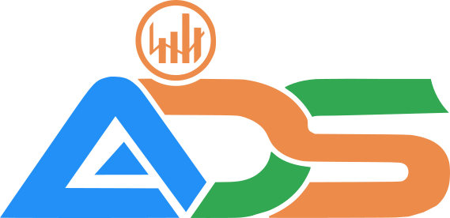

# R Tutorials: Master Data Science with R and the Tidyverse

R Tutorials is a repository dedicated to sharing data science resources and tutorials using R, specifically focusing on the {tidyverse} ecosystem. This repo is perfect for those looking to learn R programming for the first time or enhance their existing R skills. Join us to explore the power of {tidyverse} and elevate your data science journey with R!

Welcome to the R Tutorials GitHub repository!
This is your go-to resource for learning and mastering data science using the R programming language, with a primary focus on the Tidyverse collection of packages.
This repository is designed for beginners taking their first steps into R programming and experienced users who want to enhance their R programming skills.

## **Repository Overview**

We're redesigning this repostory to document ou Data Science with R tutorials in random order. Unlike before, we will not separate tutorials by level of difficulty.

## **Getting Started**

To get started with the R Tutorials, follow these steps:

1.  Install the latest version of R from the [**official website**](https://cran.r-project.org/).

2.  Install [**Positron**](https://positron.posit.co/download.html), a next-generation data science IDE built by Posit PBC.

3.  Familiarize yourself with Positron by following this [**Introducing Positron, a New Data Science IDE**](https://positron.posit.co/).

4.  Clone or download this repository to your local machine.

5.  Open the relevant R script files (.R) or Quarto files (.Rmd) in Positron and start learning!

## **Contributing**

We encourage contributions from the R community!
If you'd like to contribute to this repository, please follow these steps:

1.  Fork the repository.

2.  Create a new branch with a descriptive name.

3.  Make your changes and commit them to your branch.

4.  Submit a pull request, describing the changes you made and the motivation behind them.

We appreciate any contributions, whether it's fixing typos, improving explanations, or adding new content.

## **License**

This project is licensed under the MIT License - see the [**LICENSE**](https://chat.openai.com/LICENSE) file for details.

## **Connect with the Author**

If you have any questions, suggestions, or feedback, please feel free to reach out to me:

-   [**LinkedIn**](https://www.linkedin.com/in/tongakuot/)

-   [YouTube - Alierwai DataStudio](https://youtube.com/@tongakuotofficial)

-   [**Email**](mailto:info@ilequanuminsights.com)

Happy learning, and enjoy your journey toward becoming an R and data science expert!
